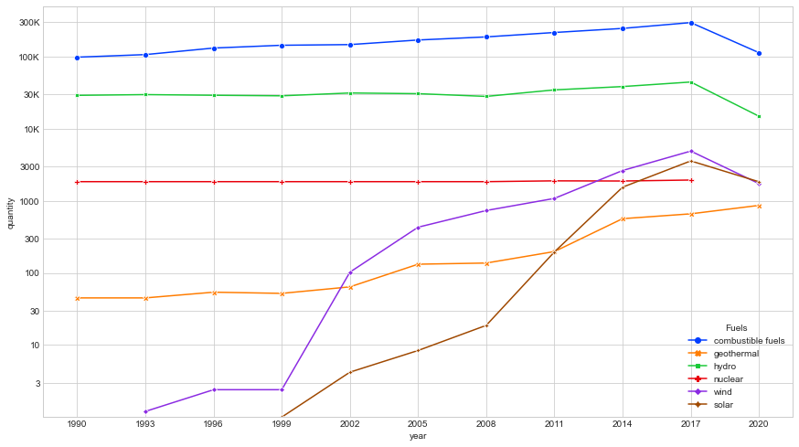
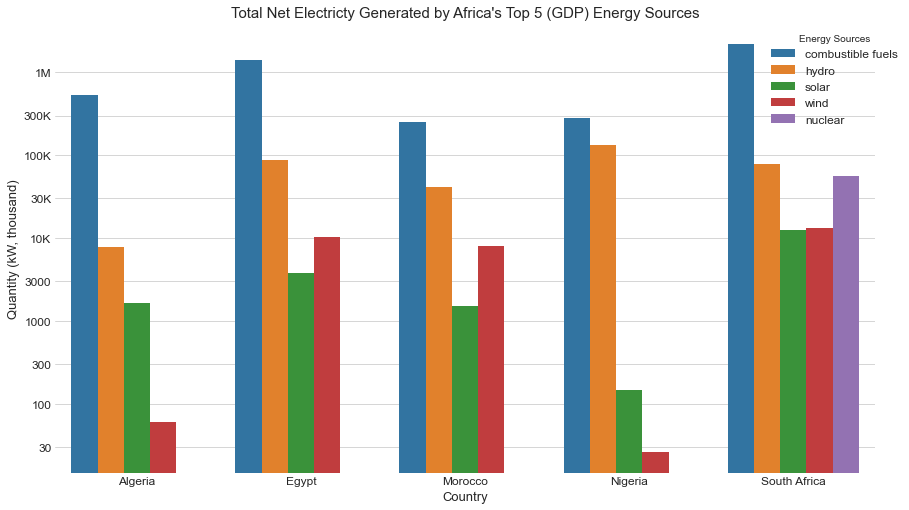

# African Nations Electricity Generation Capacity Analysis

This project analyzes the electricity generation capacity of African nations using data from the United Nations Energy database. The goal of the project is to determine the electricity generation capacity of African nations and to identify the top 5 African nations with the highest electricity generation capacity based on GDP.

## Data

The data used in this analysis is obtained from the United Nations Energy database. The database contains information on the energy production, consumption, and trade of different countries around the world. The specific data used in this analysis includes the energy mix of African nations and their electricity generating capacity.

## Analysis

The analysis is divided into two parts. First, an analysis of the different energy mixes common to African nations was performed. Second, a more focused analysis was conducted on the top 5 African nations with the highest electricity generation capacity based on GDP.

The first analysis involved comparing the energy mix of African nations, which includes sources such as oil, gas, hydro, and renewables. The analysis aims to identify the most commonly used energy sources in African nations and to determine the relative contribution of each energy source to the electricity generation capacity.

The second analysis focused on the top 5 African nations with the highest electricity generation capacity based on GDP. This analysis aims to identify the factors that contribute to high electricity generation capacity in these countries. The analysis includes a comparison of the energy mix of the top 5 African nations, as well as an examination of the investment in the energy sector and the regulatory framework in these countries.

## Results

### Trend of Energy Mix of African Nations

The above chart shows the trend of energy mix of African nations, showing the contribution of each energy
source from 1990-2020.

### Top 5 African Nations with Highest Electricity Generation Capacity

The above chart shows the top 5 African nations with the highest electricity generation capacity based on GDP, including a breakdown of their energy mix.

## Conclusion

The analysis of the electricity generation capacity of African nations highlights the importance of diversifying the energy mix and investing in renewable energy sources. The analysis of the top 5 African nations with the highest electricity generation capacity based on GDP reveals the importance of a supportive regulatory framework and significant investment in the energy sector.

Thank you for reading! If you have any questions or comments about this project, please feel free to contact me.
